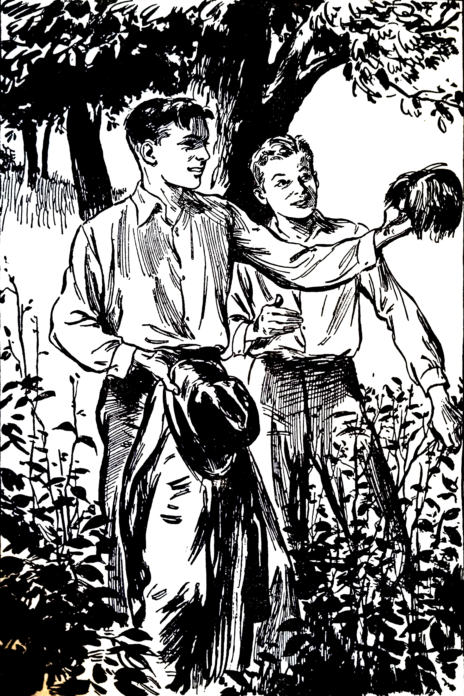

# Copyright Details

The Project Gutenberg eBook of *The Tower Treasure*, by Franklin W.Dixon

This eBook is for the use of anyone anywhere in the United States and most other parts of the world at no cost and with almost no restrictions whatsoever. You may copy it, give it away or re-use it under the terms of the Project Gutenberg License included with this eBook or online at www.gutenberg.org. If you are not located in the United States, you will have to check the laws of the country where you are located before using this eBook.

 

Title: The Tower Treasure

Author: Franklin W. Dixon

Illustrator: Walter S. Rogers

Release Date: February 20, 2023 [eBook #70083]

Language: English

Produced by: Greg Weeks, Mary Meehan and the Online DistributedProofreading Team at http://www.pgdp.net

 

*** Start Of The Project Gutenberg Ebook The Tower Treasure ***
 

::: {.copyright}

By Franklin W. Dixon

Author Of

The Hardy Boys: The House On The Cliff

The Hardy Boys: The Secret Of The Old Mill

_Illustrated By_

Walter S. Rogers

New York

Grosset & Dunlap

Publishers

Made in the United States of America

Grosset & Dunlap, Publishers, New York

Copyright, 1927, by

Grosset & Dunlap

:::

## The Hardy Boys   The Tower Treasure

